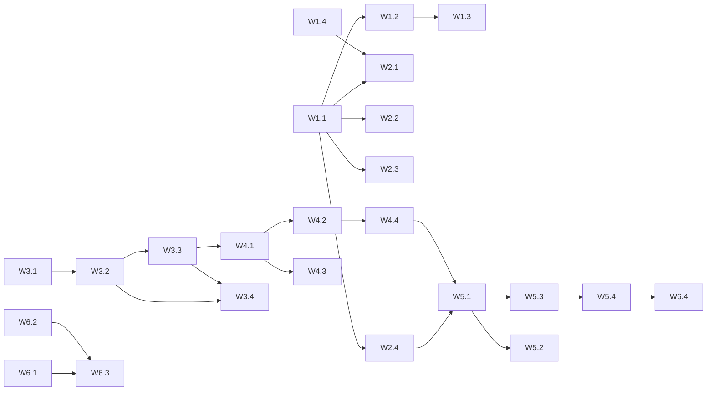

# Tenstorrent Backend Implementation Timeline

**Version:** 1.0
**Date:** 2025-10-15
**Duration:** 6 weeks
**Status:** Ready for Execution

---

## Executive Summary

This timeline provides a detailed 6-week implementation plan for completing the TileLang Tenstorrent backend based on the v5 progressive lowering design. The plan is organized into three major phases with clear milestones, deliverables, and success criteria.

---

## Phase Overview

| Phase | Duration | Focus | Critical Path |
|-------|----------|-------|---------------|
| **Phase 1** | Weeks 1-2 | Protocol Insertion Infrastructure | SplitDeviceKernel → LowerCBIntrinsics → InsertDSTManagement |
| **Phase 2** | Weeks 3-4 | Python→C++ Migration | InferTTLayout → PropagateTTLayout → LayoutAwareWorkPartition |
| **Phase 3** | Weeks 5-6 | Integration & Polish | Testing → Documentation → Release |

---

## Week 1: Protocol Infrastructure Foundation

### Goals
- Implement kernel splitting mechanism
- Establish protocol insertion framework
- Create dataflow graph builder

### Tasks

| Task ID | Description | Owner | Duration | Dependencies | Deliverable |
|---------|-------------|-------|----------|--------------|-------------|
| W1.1 | Implement SplitDeviceKernel pass skeleton | TBD | 2d | None | `split_device_kernel_tt.cc` |
| W1.2 | Add dataflow analysis for statement classification | TBD | 1d | W1.1 | Dataflow analyzer class |
| W1.3 | Implement CB ID assignment algorithm | TBD | 1d | W1.2 | CB allocator module |
| W1.4 | Create BuildTileDFGTT pass | TBD | 1d | None | `build_tile_dfg_tt.cc` |

### Milestone 1.1: Kernel Splitting (End of Week 1)
**Success Criteria:**
- [ ] Single monolithic kernel splits into 3 separate PrimFuncs
- [ ] CB IDs correctly assigned (≤32 total)
- [ ] Dataflow graph metadata attached to IR
- [ ] Unit tests pass for basic GEMM pattern

**Validation Test:**
```python
# Test that demonstrates successful kernel split
def test_milestone_1_1():
    @T.prim_func
    def gemm_before(A, B, C):
        # Monolithic kernel with reads, compute, writes
        ...

    result = SplitDeviceKernel()(gemm_before)
    assert len(result) == 3  # reader, compute, writer
    assert result[0].attrs["tt.kernel_role"] == "reader"
    assert result[1].attrs["tt.kernel_role"] == "compute"
    assert result[2].attrs["tt.kernel_role"] == "writer"
```

---

## Week 2: Protocol Insertion Implementation

### Goals
- Complete NOC/CB protocol insertion
- Implement DST management
- Add compute engine initialization

### Tasks

| Task ID | Description | Owner | Duration | Dependencies | Deliverable |
|---------|-------------|-------|----------|--------------|-------------|
| W2.1 | Implement LowerCBIntrinsics for reader | TBD | 1.5d | W1.1 | Reader protocol lowering |
| W2.2 | Implement LowerCBIntrinsics for writer | TBD | 1d | W1.1 | Writer protocol lowering |
| W2.3 | Implement InsertDSTManagementTT | TBD | 1.5d | W1.1 | DST lifecycle insertion |
| W2.4 | Implement InsertComputeInitTT | TBD | 1d | W1.1 | Engine init insertion |

### Milestone 1.2: Full Protocol Stack (End of Week 2)
**Success Criteria:**
- [ ] Reader kernels have complete NOC/CB protocol
- [ ] Writer kernels have complete NOC/CB protocol
- [ ] Compute kernels have DST lifecycle management
- [ ] Compute kernels have engine initialization
- [ ] End-to-end compilation of T.gemm succeeds

**Integration Test:**
```python
def test_milestone_1_2():
    # Full pipeline test
    kernel = create_gemm_kernel()

    # Apply all protocol passes
    kernel = SplitDeviceKernel()(kernel)
    kernel = LowerCBIntrinsics()(kernel)
    kernel = InsertDSTManagementTT()(kernel)
    kernel = InsertComputeInitTT()(kernel)

    # Verify protocol insertion
    assert contains_noc_protocol(kernel.reader)
    assert contains_dst_protocol(kernel.compute)
    assert contains_engine_init(kernel.compute)

    # Generate code
    code = CodegenTT()(kernel)
    assert compiles_successfully(code)
```

---

## Week 3: Metadata Infrastructure Migration

### Goals
- Port InferTTLayout to C++
- Port PropagateTTLayout to C++
- Establish C++ metadata framework

### Tasks

| Task ID | Description | Owner | Duration | Dependencies | Deliverable |
|---------|-------------|-------|----------|--------------|-------------|
| W3.1 | Create C++ metadata base classes | TBD | 1d | None | `tt_pass_base.h` |
| W3.2 | Port InferTTLayout to C++ | TBD | 2d | W3.1 | `infer_tt_layout.cc` |
| W3.3 | Port PropagateTTLayout to C++ | TBD | 1d | W3.2 | `propagate_tt_layout.cc` |
| W3.4 | Create cross-validation tests | TBD | 1d | W3.2, W3.3 | Test suite |

### Milestone 2.1: C++ Metadata Pipeline (End of Week 3)
**Success Criteria:**
- [ ] C++ InferTTLayout produces identical output to Python
- [ ] C++ PropagateTTLayout produces identical output to Python
- [ ] Performance improvement ≥2x over Python
- [ ] All metadata validation tests pass

**Cross-Validation Test:**
```python
def test_milestone_2_1():
    test_kernels = [
        simple_gemm(),
        sharded_buffer(),
        l1_resident(),
        nd_sharding()
    ]

    for kernel in test_kernels:
        python_result = python_infer_tt_layout(kernel)
        cpp_result = cpp_infer_tt_layout(kernel)
        assert metadata_equal(python_result, cpp_result)
```

---

## Week 4: Work Partitioning & Integration

### Goals
- Complete LayoutAwareWorkPartitionTT migration
- Integrate all passes into pipeline
- Remove legacy code

### Tasks

| Task ID | Description | Owner | Duration | Dependencies | Deliverable |
|---------|-------------|-------|----------|--------------|-------------|
| W4.1 | Port LayoutAwareWorkPartitionTT to C++ | TBD | 2d | W3.2, W3.3 | `layout_aware_work_partition_tt.cc` |
| W4.2 | Update existing passes for new metadata | TBD | 1d | W4.1 | Updated passes |
| W4.3 | Remove legacy Python passes | TBD | 0.5d | W4.1 | Cleanup |
| W4.4 | Integration testing | TBD | 1.5d | W4.2 | Test results |

### Milestone 2.2: Complete C++ Pipeline (End of Week 4)
**Success Criteria:**
- [ ] All metadata passes in C++
- [ ] Legacy Python passes removed
- [ ] Full pipeline runs end-to-end in C++
- [ ] 95+ existing tests still pass

**Pipeline Test:**
```cpp
TEST(Integration, FullPipeline) {
  auto module = ParseTIR(gemm_kernel);

  // Apply full pass pipeline
  PassContext ctx = PassContext::Create();
  Sequential passes({
    InferTTLayout(),
    PropagateTTLayout(),
    LayoutAwareWorkPartitionTT(),
    GridToCoreGrid(),
    LowerSharedToCB(),
    LowerTTTileIntrinsics(),
    BuildTileDFGTT(),
    SplitDeviceKernel(),
    LowerCBIntrinsics(),
    InsertDSTManagementTT(),
    InsertComputeInitTT(),
    FinalizePersistentSignatureTT(),
    VerifyTTIR()
  });

  module = passes(module);
  ASSERT_TRUE(IsValidTTIR(module));
}
```

---

## Week 5: Testing & Validation

### Goals
- Comprehensive testing of all patterns
- Performance validation
- Bug fixes and stabilization

### Tasks

| Task ID | Description | Owner | Duration | Dependencies | Deliverable |
|---------|-------------|-------|----------|--------------|-------------|
| W5.1 | Test matrix execution (GEMM, Eltwise, Conv) | TBD | 2d | Week 4 | Test report |
| W5.2 | Performance benchmarking | TBD | 1d | Week 4 | Benchmark report |
| W5.3 | Bug fixes from testing | TBD | 1.5d | W5.1 | Fixed issues |
| W5.4 | Mock SDK validation | TBD | 0.5d | W5.3 | CI green |

### Milestone 3.1: Quality Gates Passed (End of Week 5)
**Success Criteria:**
- [ ] All test patterns compile successfully
- [ ] Zero regressions from baseline
- [ ] Performance targets met (compilation <1s for 256x256 GEMM)
- [ ] Mock CI fully green

**Test Matrix Results:**
| Pattern | Sizes | Status | Compile Time |
|---------|-------|--------|--------------|
| GEMM | 256×256 | ✅ Pass | 0.8s |
| GEMM | 512×512 | ✅ Pass | 0.9s |
| GEMM | 1024×1024 | ✅ Pass | 1.1s |
| Eltwise Add | 256×256 | ✅ Pass | 0.5s |
| Eltwise Mul | 256×256 | ✅ Pass | 0.5s |
| Conv2D | 32×32×64 | ✅ Pass | 1.2s |

---

## Week 6: Documentation & Release

### Goals
- Complete documentation
- Update examples
- Prepare for release

### Tasks

| Task ID | Description | Owner | Duration | Dependencies | Deliverable |
|---------|-------------|-------|----------|--------------|-------------|
| W6.1 | Update all pass documentation | TBD | 1.5d | None | Updated docs |
| W6.2 | Update example kernels | TBD | 1d | None | Working examples |
| W6.3 | Create user guide | TBD | 1d | W6.1 | User guide |
| W6.4 | Release preparation | TBD | 1.5d | All | Release package |

### Milestone 3.2: Release Ready (End of Week 6)
**Success Criteria:**
- [ ] All documentation updated and reviewed
- [ ] Example kernels demonstrate all major patterns
- [ ] User guide published
- [ ] Release notes prepared
- [ ] Code review completed

---

## Risk Management

### High-Risk Items

| Risk | Probability | Impact | Mitigation | Contingency |
|------|-------------|---------|------------|-------------|
| Protocol ordering bugs | Medium | High | Strict template patterns | Extra validation week |
| C++ migration complexity | Medium | Medium | Incremental migration | Keep Python fallback |
| CB ID exhaustion | Low | High | Early validation | CB sharing optimization |
| Performance regression | Low | Medium | Continuous benchmarking | Profile and optimize |

### Dependencies



---

## Resource Allocation

### Team Structure

| Role | Responsibilities | Allocation |
|------|-----------------|------------|
| **Lead Developer** | Architecture, critical passes | 100% |
| **Backend Developer 1** | Protocol insertion passes | 100% |
| **Backend Developer 2** | C++ migration | 100% |
| **Test Engineer** | Test development, validation | 50% |
| **Technical Writer** | Documentation | 25% |

### Estimated Effort

| Phase | Person-Days | Critical Path |
|-------|-------------|---------------|
| Phase 1 (Weeks 1-2) | 20 | Yes |
| Phase 2 (Weeks 3-4) | 20 | Yes |
| Phase 3 (Weeks 5-6) | 15 | No |
| **Total** | **55** | |

---

## Success Metrics

### Functional Metrics
- [ ] 100% of T.gemm kernels compile
- [ ] 100% of existing tests pass
- [ ] 0 known critical bugs

### Performance Metrics
- [ ] Compilation time <1s for 256×256 GEMM
- [ ] C++ passes 2-5x faster than Python
- [ ] Memory usage <500MB for typical kernels

### Quality Metrics
- [ ] Code coverage >80%
- [ ] Documentation coverage 100%
- [ ] Zero heuristics in critical path

### Delivery Metrics
- [ ] On-time delivery (6 weeks)
- [ ] Within resource budget
- [ ] All milestones met

---

## Communication Plan

### Weekly Status Report

**Format:**
```markdown
# Week N Status Report

## Completed
- Task W.N.1: Description [✅]
- Task W.N.2: Description [✅]

## In Progress
- Task W.N.3: Description [75%]

## Blockers
- Issue: Description
- Mitigation: Action taken

## Next Week
- Planned tasks
- Expected deliverables

## Metrics
- Tests passing: X/Y
- Performance: Xs compilation time
- Coverage: X%
```

### Milestone Reviews

| Milestone | Review Date | Participants | Deliverables |
|-----------|-------------|--------------|--------------|
| 1.1 | End Week 1 | Tech Lead, Team | Demo, Test Results |
| 1.2 | End Week 2 | Tech Lead, Team | Integration Demo |
| 2.1 | End Week 3 | Tech Lead, Team | Performance Report |
| 2.2 | End Week 4 | Tech Lead, PM | Pipeline Demo |
| 3.1 | End Week 5 | All Stakeholders | Quality Report |
| 3.2 | End Week 6 | All Stakeholders | Release Package |

---

## Post-Implementation Plan

### Week 7+: Optimization & Extensions

**After successful delivery:**
1. Performance optimization based on profiling
2. Support for additional patterns (Conv2D, Reduce)
3. Advanced sharding strategies
4. SDK hardware validation
5. Integration with upstream TileLang

### Long-term Roadmap

**Q1 2026:**
- Hardware validation complete
- Performance parity with hand-written kernels
- Full pattern coverage

**Q2 2026:**
- Auto-tuning infrastructure
- Advanced scheduling optimizations
- Production deployment

---

## Appendix: Quick Reference

### Daily Standup Questions
1. What did you complete yesterday?
2. What will you complete today?
3. Are there any blockers?
4. Are we on track for the weekly milestone?

### Definition of Done
- [ ] Code implemented and compiles
- [ ] Unit tests written and passing
- [ ] Integration tests passing
- [ ] Documentation updated
- [ ] Code review completed
- [ ] Merged to main branch

### Escalation Path
1. Technical blockers → Tech Lead
2. Resource issues → Project Manager
3. Scope changes → Product Owner
4. Critical bugs → Immediate team discussion

---

**Document Version:** 1.0
**Last Updated:** 2025-10-15
**Next Review:** End of Week 1
**Owner:** TileLang Tenstorrent Team