# TT Backend Pass Pipeline Status Tracker

**Based on:** TileLang TT TIR Lowering Guide v5
**Last Updated:** 2025-10-15
**Purpose:** Track implementation status of all passes in the v5 progressive lowering pipeline

---

## Pipeline Overview

The complete pipeline consists of **17 passes** organized into **7 stages** (A-G).

### Design Principles
1. **Progressive lowering**: Early passes attach metadata & restructure loops; late passes insert device protocols
2. **Protocol-less mid-level TIR**: Compute expressed over CB-backed buffers without CB handshakes or DST logic
3. **Late protocolization**: After SplitDeviceKernel, inject NOC/CB sequences, DST management, and compute engine init
4. **Persistent kernels**: Materialize per-core tile loops during codegen, not as TIR loops

---

## Complete Pass Pipeline with Status

| # | Pass | Stage | Status | Location | Notes |
|---|------|-------|--------|----------|-------|
| **A1** | **InferTTLayout** | Metadata | 🟡 Exists, needs v5 update | `tilelang/tenstorrent/passes/infer_tt_layout.py` | Normalize buffer defaults, handle ND sharding |
| **A2** | **PropagateTTLayout** | Metadata | 🟡 Exists, needs v5 update | `tilelang/tenstorrent/passes/propagate_tt_layout.py` | Derive CB geometry from layout |
| **A3** | **AttachTensorAccessorTT** | Metadata | 🔴 Not implemented | - | Attach abstract TensorAccessor descriptors |
| **B1** | **LayoutAwareWorkPartitionTT** | Partitioning | 🟡 Exists, needs v5 update | `tilelang/tenstorrent/passes/layout_aware_work_partition_tt.py` | Choose core grid and work partition |
| **B2** | **GridToCoreGrid** | Partitioning | ✅ v5 implemented | `tilelang/tenstorrent/passes/grid_to_core_grid_v5.py` | Convert grid loops to T.launch_core |
| **C1** | **LowerSharedToCB** | Protocol-less | ✅ v5 implemented | `tilelang/tenstorrent/passes/lower_shared_to_cb_v5.py` | Shared → conceptual CBs (protocol-less) |
| **C2** | **LowerTTTileIntrinsics** | Protocol-less | ✅ v5 implemented | `tilelang/tenstorrent/passes/lower_tt_tile_intrinsics_v5.py` | Tensorize compute (no DST/engine init) |
| **C3** | **BuildTileDFGTT** | Protocol-less | 🔴 Not implemented | - | Build tile dataflow graph |
| **D1** | **SplitDeviceKernel** | Late Split | 🔴 Not implemented | - | Split into reader/compute/writer |
| **D2** | **ConfigureTensorAccessorTT** | Late Split | 🔴 Not implemented | - | Bind TensorAccessorArgs slots |
| **D3** | **LowerCBIntrinsics** | Late Split | 🔴 Not implemented | - | Insert NOC/CB protocol |
| **D4** | **InsertComputeInitTT** | Late Split | 🔴 Not implemented | - | Insert engine init protocol |
| **D5** | **InsertDSTManagementTT** | Late Split | 🔴 Not implemented | - | Wrap compute with DST lifecycle |
| **E1** | **FinalizePersistentSignatureTT** | Finalization | 🟡 Partial | Mixed locations | Freeze runtime args |
| **F** | **VerifyTTIR** | Verification | 🟡 Exists, needs update | `src/transform/tenstorrent/verify_tt_ir.cc` | Constraint checking |
| **G** | **CodegenTT** | Codegen | ✅ Working | `src/target/tenstorrent/codegen_tt.cc` | Emit C++ kernels + host |

### Status Legend
- ✅ **Complete**: Fully implemented to v5 spec
- 🟡 **Needs Update**: Exists but needs modification for v5
- 🔴 **Not Implemented**: New pass needed
- ⚠️ **Blocked**: Waiting on dependencies

---

## Detailed Pass Specifications

### Stage A: Early Metadata (A1-A3)

| Pass | Input | Output | Attributes Added | Implementation Tasks |
|------|-------|--------|-----------------|---------------------|
| **A1: InferTTLayout** | Buffer declarations with optional annotations | Buffers with normalized layout | `tt.layout_desc[buf]` with memory, layout, tile_shape, dtype, nd_shard | • Handle defaults (DRAM, interleaved, bf16, 32×32) • ND sharding validation • L1 capacity checks • Halo rejection |
| **A2: PropagateTTLayout** | `tt.layout_desc` | CB descriptors | `tt.cb_desc[name]` with page_size, depth, data_format | • Calculate page_size from dtype×tile • Default depth=2 • Format conversion |
| **A3: AttachTensorAccessorTT** | `tt.layout_desc` | Abstract accessors | `tt.tensor_accessor[buf]` (compile-time only) | • Create abstract descriptors • Link to layout • Leave runtime fields null |

### Stage B: Work Partitioning (B1-B2)

| Pass | Input | Output | Attributes Added | Implementation Tasks |
|------|-------|--------|-----------------|---------------------|
| **B1: LayoutAwareWorkPartitionTT** | Shapes + layout | Partition plan | `tt.core_grid`, `tt.core_ranges`, `tt.partition_mode`, `tt.grid_tiles`, `tt.work_partition`, `tt.runtime_args` | • Global vs local_shard selection • Balanced work distribution • Runtime args template |
| **B2: GridToCoreGrid** | Grid loops | Core launch | `tt.core_map_i/j` | • Convert T.Kernel → T.launch_core • Keep body intact |

### Stage C: Protocol-less Lowering (C1-C3)

| Pass | Input | Output | Attributes Added | Implementation Tasks |
|------|-------|--------|-----------------|---------------------|
| **C1: LowerSharedToCB** | `alloc_shared`, `T.copy` | `tt.alloc_cb`, `tt.read_to_cb`, `tt.write_from_cb` (abstract) | - | • No CB IDs • No NOC calls |
| **C2: LowerTTTileIntrinsics** | `T.gemm`, element-wise | `tt.mm.mma`, `tt.fpu.*`, `tt.sfpu.*` (no DST) | `tt.compute.pattern` hints | • No "_tile" heuristics • No DST/engine init |
| **C3: BuildTileDFGTT** | CB allocs + moves | Dataflow graph | `tt.tile_dfg` with nodes, edges, CB roles | • Analyze producer-consumer • Validate CB count ≤32 |

### Stage D: Late Protocol Insertion (D1-D5)

| Pass | Input | Output | Attributes Added | Implementation Tasks |
|------|-------|--------|-----------------|---------------------|
| **D1: SplitDeviceKernel** | Monolithic kernel | 3 PrimFuncs | `tt.kernel_role`, CB IDs assigned | • Clone & slice by role • Assign CB IDs |
| **D2: ConfigureTensorAccessorTT** | Abstract accessors | Bound accessors | Updated `tt.tensor_accessor` with arg indices | • Reader/writer only • Bind runtime args |
| **D3: LowerCBIntrinsics** | Abstract CB ops | NOC/CB protocol | - | • Reader: reserve→read→push • Writer: wait→write→pop |
| **D4: InsertComputeInitTT** | Protocol-less compute | Initialized compute | - | • Detect patterns • Insert init calls |
| **D5: InsertDSTManagementTT** | Compute ops | DST-wrapped compute | - | • K-loop vs per-tile • DST acquire/release • Pack operations |

### Stage E-G: Finalization

| Pass | Input | Output | Attributes Added | Implementation Tasks |
|------|-------|--------|-----------------|---------------------|
| **E1: FinalizePersistentSignatureTT** | Split kernels | Finalized signatures | Complete `tt.runtime_args` | • Global: start_id, count, Mt, Kt, Nt • Local: + Sm, Sn, Gy, Gx, sy, sx |
| **F: VerifyTTIR** | Complete IR | Validated IR | - | • CB count ≤32 • L1 capacity • Dtype support |
| **G: CodegenTT** | Validated IR | C++ code | - | • 3 kernels + host • Persistent loop in codegen |

---

## Implementation Priority Order

### Phase 0: Update Existing Passes (Current)
1. **A1: InferTTLayout** - Update to v5 spec
2. **A2: PropagateTTLayout** - Update to v5 spec
3. **B1: LayoutAwareWorkPartitionTT** - Update to v5 spec

### Phase 1: Complete Protocol-less Pipeline
4. **A3: AttachTensorAccessorTT** - New implementation
5. **C3: BuildTileDFGTT** - New implementation

### Phase 2: Kernel Splitting
6. **D1: SplitDeviceKernel** - Critical new pass
7. **D2: ConfigureTensorAccessorTT** - Support pass

### Phase 3: Protocol Insertion
8. **D3: LowerCBIntrinsics** - Reader/writer protocol
9. **D4: InsertComputeInitTT** - Compute init
10. **D5: InsertDSTManagementTT** - DST management

### Phase 4: Finalization
11. **E1: FinalizePersistentSignatureTT** - Update existing
12. **F: VerifyTTIR** - Update for v5 schema

---

## Pass Dependencies

```mermaid
graph TD
    A1[A1: InferTTLayout] --> A2[A2: PropagateTTLayout]
    A2 --> A3[A3: AttachTensorAccessorTT]
    A3 --> B1[B1: LayoutAwareWorkPartitionTT]
    B1 --> B2[B2: GridToCoreGrid ✅]
    B2 --> C1[C1: LowerSharedToCB ✅]
    C1 --> C2[C2: LowerTTTileIntrinsics ✅]
    C2 --> C3[C3: BuildTileDFGTT]
    C3 --> D1[D1: SplitDeviceKernel]
    D1 --> D2[D2: ConfigureTensorAccessorTT]
    D1 --> D3[D3: LowerCBIntrinsics]
    D1 --> D4[D4: InsertComputeInitTT]
    D1 --> D5[D5: InsertDSTManagementTT]
    D2 --> E1[E1: FinalizePersistentSignatureTT]
    D3 --> E1
    D4 --> E1
    D5 --> E1
    E1 --> F[F: VerifyTTIR]
    F --> G[G: CodegenTT ✅]

    style A1 fill:#ffcc99
    style A2 fill:#ffcc99
    style A3 fill:#ff9999
    style B1 fill:#ffcc99
    style B2 fill:#99ff99
    style C1 fill:#99ff99
    style C2 fill:#99ff99
    style C3 fill:#ff9999
    style D1 fill:#ff9999
    style D2 fill:#ff9999
    style D3 fill:#ff9999
    style D4 fill:#ff9999
    style D5 fill:#ff9999
    style E1 fill:#ffcc99
    style F fill:#ffcc99
    style G fill:#99ff99
```

**Legend:**
- 🟢 Green: Complete (v5 ready)
- 🟡 Yellow: Needs update
- 🔴 Red: Not implemented

---

## Current Work Queue

### Immediate (Week 1)
- [ ] Update A1: InferTTLayout to v5 spec
- [ ] Update A2: PropagateTTLayout to v5 spec
- [ ] Update B1: LayoutAwareWorkPartitionTT to v5 spec
- [ ] Implement A3: AttachTensorAccessorTT
- [ ] Implement C3: BuildTileDFGTT

### Next (Week 2)
- [ ] Implement D1: SplitDeviceKernel
- [ ] Implement D3: LowerCBIntrinsics
- [ ] Implement D5: InsertDSTManagementTT

### Later (Week 3)
- [ ] Implement D2: ConfigureTensorAccessorTT
- [ ] Implement D4: InsertComputeInitTT
- [ ] Update E1: FinalizePersistentSignatureTT
- [ ] Update F: VerifyTTIR

---

## Testing Requirements

### Per-Pass Tests
- Unit tests for each pass
- Input/output validation
- Metadata propagation tests
- Error case handling

### Integration Tests
- Sequential pass application
- Metadata flow through pipeline
- GEMM end-to-end
- Element-wise operations
- Mixed patterns

### Validation Tests
- Protocol-less validation (Stages A-C)
- Kernel split validation (Stage D)
- Protocol insertion validation (Stage D)
- Codegen validation (Stage G)

---

## Notes

### Key Changes from Previous Design
1. **Late SplitDeviceKernel** - Now in Stage D instead of early
2. **Protocol-less compute** - No DST/engine init until D4/D5
3. **Abstract accessors** - Attached early (A3), bound late (D2)
4. **Persistent loop in codegen** - Not in TIR

### Implementation Language
- **Python first** for rapid development (all new passes)
- **C++ migration** only after stabilization (Phase 2 of project)

---

**Document Version:** 1.0
**Created:** 2025-10-15
**Next Review:** After Phase 0 completion