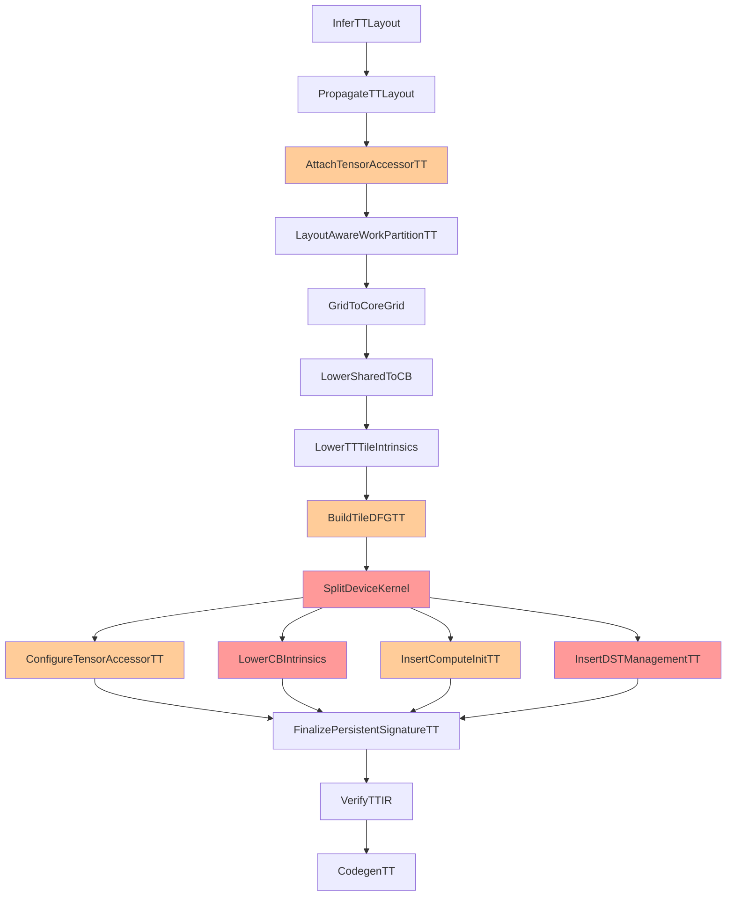

# Tenstorrent Backend Pass Specifications

**Version:** 1.0
**Date:** 2025-10-15
**Status:** Implementation Reference

---

## Overview

This document provides detailed specifications and implementation guidance for each pass in the TileLang Tenstorrent backend pipeline. Each specification includes input/output examples, implementation algorithms, and C++ code templates.

---

## Critical New Passes (Priority 0)

### D1: SplitDeviceKernel

**Purpose**: Split monolithic kernel into reader/compute/writer kernels

#### Algorithm
```
1. Analyze TIR to identify:
   - Data movement operations (reads/writes)
   - Compute operations (matmul, binary ops)
   - Buffer dependencies

2. Create three PrimFunc clones:
   - Reader: Contains only read_to_cb operations
   - Compute: Contains only compute operations
   - Writer: Contains only write_from_cb operations

3. Assign CB IDs based on dataflow graph:
   - Input CBs: cb_in0, cb_in1, ... (up to cb_in7)
   - Output CBs: cb_out0, cb_out1, ... (up to cb_out7)
   - Intermediate CBs: cb_intermed0, ... (if needed)

4. Update function signatures:
   - Reader: Takes input tensors
   - Compute: No tensor arguments (uses CBs)
   - Writer: Takes output tensors

5. Stamp kernel role attributes
```

#### Input/Output Example

**Input (Monolithic)**:
```python
@T.prim_func
def gemm_monolithic(A: T.Buffer, B: T.Buffer, C: T.Buffer):
    A_cb = tt.alloc_cb("cb_a", (4, 1), "bf16")  # 4 tiles
    B_cb = tt.alloc_cb("cb_b", (1, 4), "bf16")
    C_cb = tt.alloc_cb("cb_c", (4, 4), "bf16")

    for kt in T.serial(8):
        T.evaluate(tt.read_to_cb(A[m, kt*32], A_cb))
        T.evaluate(tt.read_to_cb(B[kt*32, n], B_cb))
        T.evaluate(tt.mm.mma(A_cb, B_cb, dst=0, accumulate=(kt>0)))

    T.evaluate(tt.write_from_cb(C_cb, C[m, n]))
```

**Output (3 Kernels)**:

```python
@T.prim_func(attrs={"tt.kernel_role": "reader"})
def gemm_reader(A: T.Buffer, B: T.Buffer):
    # CBs get concrete IDs
    for kt in T.serial(8):
        T.evaluate(tt.read_to_cb(A[m, kt*32], "cb_in0"))
        T.evaluate(tt.read_to_cb(B[kt*32, n], "cb_in1"))

@T.prim_func(attrs={"tt.kernel_role": "compute"})
def gemm_compute():
    for kt in T.serial(8):
        T.evaluate(tt.mm.mma("cb_in0", "cb_in1", dst=0, accumulate=(kt>0)))
    # Note: packing to cb_out0 will be added by D5

@T.prim_func(attrs={"tt.kernel_role": "writer"})
def gemm_writer(C: T.Buffer):
    T.evaluate(tt.write_from_cb("cb_out0", C[m, n]))
```

#### C++ Implementation Template

```cpp
class SplitDeviceKernelTT : public tvm::tir::StmtExprMutator {
public:
  PrimFunc Run(PrimFunc func) {
    // Step 1: Analyze to classify statements
    DataflowAnalyzer analyzer;
    analyzer.Visit(func->body);

    // Step 2: Create three function clones
    PrimFunc reader = CloneFunction(func, "reader");
    PrimFunc compute = CloneFunction(func, "compute");
    PrimFunc writer = CloneFunction(func, "writer");

    // Step 3: Filter statements for each kernel
    reader = FilterStatements(reader, analyzer.read_stmts);
    compute = FilterStatements(compute, analyzer.compute_stmts);
    writer = FilterStatements(writer, analyzer.write_stmts);

    // Step 4: Assign CB IDs
    CBAllocator cb_alloc;
    reader = cb_alloc.AssignCBIds(reader, "input");
    compute = cb_alloc.AssignCBIds(compute, "compute");
    writer = cb_alloc.AssignCBIds(writer, "output");

    // Step 5: Update signatures and attributes
    reader = UpdateSignature(reader, keep_inputs=true, keep_outputs=false);
    compute = UpdateSignature(compute, keep_inputs=false, keep_outputs=false);
    writer = UpdateSignature(writer, keep_inputs=false, keep_outputs=true);

    // Return IRModule with all three functions
    return CreateModule({reader, compute, writer});
  }
};
```

---

### D3: LowerCBIntrinsics

**Purpose**: Replace abstract CB operations with NOC/CB protocol sequences

#### Algorithm
```
1. For each tt.read_to_cb:
   a. Insert cb_reserve_back
   b. Get write pointer
   c. Insert noc_async_read_tile
   d. Insert noc_async_read_barrier
   e. Insert cb_push_back

2. For each tt.write_from_cb:
   a. Insert cb_wait_front
   b. Get read pointer
   c. Insert noc_async_write_tile
   d. Insert noc_async_write_barrier
   e. Insert cb_pop_front

3. Handle pipelining optimizations:
   - Batch barriers for multiple tiles
   - Double-buffering patterns
```

#### Input/Output Example

**Input (Abstract)**:
```python
# Reader kernel
T.evaluate(tt.read_to_cb(A[tile_m, tile_k], "cb_in0"))
```

**Output (Protocolized)**:
```python
# Reader kernel with full protocol
T.evaluate(cb_reserve_back("cb_in0", 1))
write_ptr = get_write_ptr("cb_in0")
tile_id = tile_m * Kt + tile_k
T.evaluate(noc_async_read_tile(tile_id, A_accessor, write_ptr))
T.evaluate(noc_async_read_barrier())
T.evaluate(cb_push_back("cb_in0", 1))
```

#### C++ Implementation Template

```cpp
class LowerCBIntrinsicsTT : public tvm::tir::StmtExprMutator {
public:
  Stmt VisitStmt_(const EvaluateNode* op) override {
    if (auto* call = op->value.as<CallNode>()) {
      if (call->op.same_as(tt_read_to_cb)) {
        return LowerReadToCB(call);
      } else if (call->op.same_as(tt_write_from_cb)) {
        return LowerWriteFromCB(call);
      }
    }
    return StmtExprMutator::VisitStmt_(op);
  }

private:
  Stmt LowerReadToCB(const CallNode* call) {
    // Extract arguments
    PrimExpr tensor_slice = call->args[0];
    String cb_name = call->args[1];

    // Build protocol sequence
    Array<Stmt> stmts;

    // 1. Reserve CB space
    stmts.push_back(Evaluate(Call(cb_reserve_back, {cb_name, 1})));

    // 2. Get write pointer
    Var write_ptr("write_ptr", DataType::UInt(32));
    stmts.push_back(LetStmt(write_ptr, Call(get_write_ptr, {cb_name})));

    // 3. Calculate tile ID and accessor
    PrimExpr tile_id = CalculateTileId(tensor_slice);
    PrimExpr accessor = GetTensorAccessor(tensor_slice);

    // 4. NOC read
    stmts.push_back(Evaluate(Call(noc_async_read_tile,
                                  {tile_id, accessor, write_ptr})));

    // 5. Barrier
    stmts.push_back(Evaluate(Call(noc_async_read_barrier, {})));

    // 6. Push to CB
    stmts.push_back(Evaluate(Call(cb_push_back, {cb_name, 1})));

    return SeqStmt(stmts);
  }
};
```

---

### D5: InsertDSTManagementTT

**Purpose**: Wrap compute operations with DST register lifecycle management

#### Algorithm
```
1. Identify compute patterns:
   - K-loop accumulation (matmul with reduction)
   - Per-tile operations (element-wise)

2. For K-loop patterns:
   - Insert acquire BEFORE loop
   - Keep compute operations
   - Insert commit/wait/pack/release AFTER loop

3. For per-tile patterns:
   - Insert acquire/commit/wait/pack/release PER tile

4. Add CB synchronization:
   - cb_wait_front before compute
   - cb_pop_front after compute
   - cb_reserve_back before pack
   - cb_push_back after pack
```

#### Input/Output Example

**Input (K-loop pattern)**:
```python
for kt in T.serial(8):
    T.evaluate(tt.mm.mma("cb_in0", "cb_in1", dst=0, accumulate=(kt>0)))
```

**Output (With DST management)**:
```python
T.evaluate(tt.dst.acquire())

for kt in T.serial(8):
    T.evaluate(cb_wait_front("cb_in0", 1))
    T.evaluate(cb_wait_front("cb_in1", 1))
    T.evaluate(tt.mm.mma("cb_in0", "cb_in1", dst=0, accumulate=(kt>0)))
    T.evaluate(cb_pop_front("cb_in0", 1))
    T.evaluate(cb_pop_front("cb_in1", 1))

T.evaluate(cb_reserve_back("cb_out0", 1))
T.evaluate(tt.dst.commit())
T.evaluate(tt.dst.wait())
T.evaluate(pack_tile(dst=0, cb="cb_out0", tile_index=0))
T.evaluate(tt.dst.release())
T.evaluate(cb_push_back("cb_out0", 1))
```

#### C++ Implementation Template

```cpp
class InsertDSTManagementTT : public tvm::tir::StmtExprMutator {
public:
  Stmt VisitStmt_(const ForNode* op) override {
    // Check if this is a K-loop pattern
    if (IsKLoopPattern(op)) {
      return WrapKLoopWithDST(op);
    }
    return StmtExprMutator::VisitStmt_(op);
  }

private:
  bool IsKLoopPattern(const ForNode* loop) {
    // Check for accumulating matmul pattern
    KLoopDetector detector;
    detector.Visit(loop->body);
    return detector.found_accumulating_mma;
  }

  Stmt WrapKLoopWithDST(const ForNode* loop) {
    Array<Stmt> stmts;

    // 1. Acquire DST before loop
    stmts.push_back(Evaluate(Call(tt_dst_acquire, {})));

    // 2. Transform loop body to add CB sync
    Stmt new_body = AddCBSyncToCompute(loop->body);
    For new_loop = For(loop->loop_var, loop->min, loop->extent,
                       loop->kind, new_body);
    stmts.push_back(new_loop);

    // 3. Pack and release after loop
    stmts.push_back(Evaluate(Call(cb_reserve_back, {"cb_out0", 1})));
    stmts.push_back(Evaluate(Call(tt_dst_commit, {})));
    stmts.push_back(Evaluate(Call(tt_dst_wait, {})));
    stmts.push_back(Evaluate(Call(pack_tile, {0, "cb_out0", 0})));
    stmts.push_back(Evaluate(Call(tt_dst_release, {})));
    stmts.push_back(Evaluate(Call(cb_push_back, {"cb_out0", 1})));

    return SeqStmt(stmts);
  }
};
```

---

## Protocol-less Passes (Priority 1)

### C3: BuildTileDFGTT

**Purpose**: Build tile-level dataflow graph for CB assignment

#### Algorithm
```
1. Traverse TIR to find all CB allocations
2. Build producer-consumer relationships:
   - read_to_cb produces to CB
   - CB consumed by compute ops
   - compute ops produce to output CB
   - write_from_cb consumes from CB
3. Assign roles to CBs (input_a, input_b, output, intermediate)
4. Validate CB count (≤32 total)
5. Store as tt.tile_dfg attribute
```

#### Implementation Example

```cpp
class BuildTileDFGTT : public tvm::tir::StmtExprVisitor {
public:
  Map<String, Object> BuildGraph(const Stmt& stmt) {
    // Visit to collect all CB operations
    this->VisitStmt(stmt);

    // Build graph structure
    Map<String, Object> dfg;
    dfg.Set("nodes", Array<String>(cb_nodes.begin(), cb_nodes.end()));
    dfg.Set("edges", BuildEdges());
    dfg.Set("cb_roles", AssignRoles());

    // Validate
    CHECK_LE(cb_nodes.size(), 32) << "Too many CBs: " << cb_nodes.size();

    return dfg;
  }

private:
  std::set<String> cb_nodes;
  std::vector<std::pair<String, String>> edges;

  void VisitStmt_(const EvaluateNode* op) override {
    if (auto* call = op->value.as<CallNode>()) {
      if (call->op.same_as(tt_alloc_cb)) {
        String cb_name = call->args[0].as<StringImmNode>()->value;
        cb_nodes.insert(cb_name);
      } else if (call->op.same_as(tt_read_to_cb)) {
        // Edge from tensor to CB
        String cb = ExtractCBName(call->args[1]);
        edges.push_back({"input", cb});
      } else if (IsComputeOp(call)) {
        // Edges from input CBs to compute to output CB
        ExtractComputeEdges(call);
      }
    }
    StmtExprVisitor::VisitStmt_(op);
  }
};
```

---

## Metadata Passes (Priority 2)

### A3: AttachTensorAccessorTT

**Purpose**: Create abstract tensor accessor metadata

#### Algorithm
```
1. For each buffer in function signature:
   - Create abstract accessor descriptor
   - Link to layout descriptor
   - Set stride mode based on layout
   - Leave runtime binding fields null
2. Store as buffer attribute
```

#### Implementation Example

```cpp
class AttachTensorAccessorTT : public tvm::tir::PrimFuncPass {
public:
  PrimFunc operator()(PrimFunc f) {
    for (const auto& param : f->params) {
      if (auto* buf = f->buffer_map.at(param).as<BufferNode>()) {
        Map<String, Object> accessor;
        accessor.Set("type", String("abstract"));
        accessor.Set("layout_ref", String("tt.layout_desc[") + buf->name + "]");
        accessor.Set("stride_mode", String("tiled"));
        accessor.Set("base_offset", NullValue<PrimExpr>());
        accessor.Set("runtime_arg_idx", NullValue<Integer>());

        // Attach as buffer attribute
        buf = WithAttr(buf, "tt.tensor_accessor", accessor);
      }
    }
    return f;
  }
};
```

### D2: ConfigureTensorAccessorTT

**Purpose**: Bind tensor accessors to runtime arguments

#### Algorithm
```
1. For reader/writer kernels only:
   - Get runtime arg order from tt.runtime_args
   - For each buffer:
     - Find corresponding arg index
     - Calculate tile_size_bytes
     - Update accessor with binding info
2. Store updated accessors
```

---

## Pass Dependency Graph



Legend:
- 🔴 Red: Critical new passes (P0)
- 🟡 Orange: Important new passes (P1)
- ⬜ White: Existing passes needing updates

---

## Testing Templates

### Unit Test Template

```python
def test_pass_name_basic():
    """Test basic functionality of PassName"""
    # Create input IR
    @T.prim_func
    def before(A: T.Buffer((256, 256), "bf16")):
        # Input IR structure
        pass

    # Apply pass
    after = tvm.tir.transform.PassName()(before)

    # Verify output
    assert "expected_attribute" in after.attrs
    assert after.attrs["expected_attribute"] == expected_value

def test_pass_name_edge_cases():
    """Test edge cases"""
    # Test with maximum CBs (32)
    # Test with minimum buffers (0)
    # Test with unusual tile sizes

def test_pass_name_errors():
    """Test error handling"""
    # Test CB overflow (>32)
    # Test missing metadata
    # Test invalid patterns
```

### Integration Test Template

```python
def test_pipeline_segment():
    """Test pass pipeline segment"""
    # Input kernel
    kernel = create_test_kernel()

    # Apply pass sequence
    passes = [
        PassA(),
        PassB(),
        PassC()
    ]

    for pass_func in passes:
        kernel = pass_func(kernel)
        validate_intermediate(kernel)

    # Verify final state
    assert_valid_output(kernel)
```

---

## Implementation Checklist

### Phase 1: Critical Path (P0)
- [ ] D1: SplitDeviceKernel
  - [ ] Dataflow analysis
  - [ ] Statement classification
  - [ ] CB ID assignment
  - [ ] Function cloning and filtering
- [ ] D3: LowerCBIntrinsics
  - [ ] Reader protocol insertion
  - [ ] Writer protocol insertion
  - [ ] Pipelining optimizations
- [ ] D5: InsertDSTManagementTT
  - [ ] K-loop pattern detection
  - [ ] Per-tile pattern detection
  - [ ] DST lifecycle insertion
  - [ ] CB synchronization

### Phase 2: Supporting Infrastructure (P1)
- [ ] C3: BuildTileDFGTT
  - [ ] Graph construction
  - [ ] Role assignment
  - [ ] Validation
- [ ] A3: AttachTensorAccessorTT
  - [ ] Abstract descriptor creation
  - [ ] Layout linking
- [ ] D2: ConfigureTensorAccessorTT
  - [ ] Runtime arg binding
  - [ ] Tile size calculation
- [ ] D4: InsertComputeInitTT
  - [ ] Pattern detection
  - [ ] Init call insertion

### Phase 3: C++ Migration (P2)
- [ ] Port InferTTLayout
- [ ] Port PropagateTTLayout
- [ ] Port LayoutAwareWorkPartitionTT
- [ ] Remove legacy passes

---

**Document Version:** 1.0
**Last Updated:** 2025-10-15