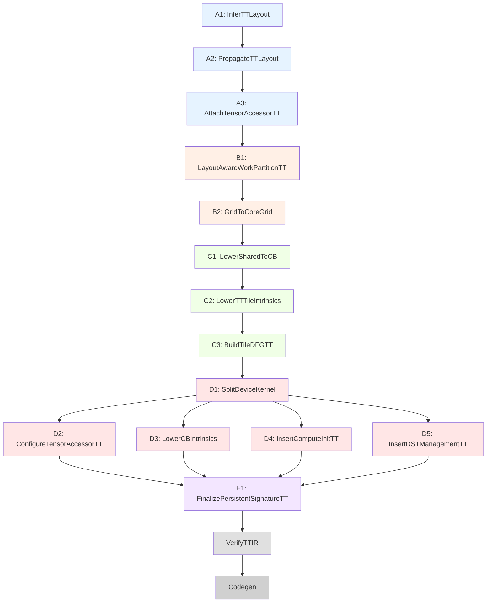

# TileLang Tenstorrent Pass Documentation

**Last Updated:** 2025-10-16
**Pipeline Version:** v5 (14 passes, Python-only)

---

## Overview

This directory contains documentation for the TileLang Tenstorrent backend pass pipeline. The v5 pipeline consists of **14 passes** organized into **5 stages (A-E)**, all implemented in Python.

---

## Quick Navigation

### 📚 Comprehensive References
- [v5_pipeline.md](../architecture/v5_pipeline.md) - **800+ line authoritative v5 reference**
- [v5_pipeline.md](../architecture/v5_pipeline.md) - Authoritative v5 pipeline reference (800+ lines)
- [TT_ARCHITECTURE.md](../architecture/TT_ARCHITECTURE.md) - Backend architecture

### 🎯 Stage-Based Documentation
- [Stage A: Metadata](./stages/metadata.md) - 3 passes (A1-A3)
- [Stage B: Partitioning](./stages/partitioning.md) - 2 passes (B1-B2)
- [Stage C: Protocol-less Lowering](./stages/protocol_less.md) - 3 passes (C1-C3)
- [Stage D: Late Split & Protocol](./stages/late_split.md) - 5 passes (D1-D5)
- [Stage E: Finalization](./stages/finalization.md) - 1 pass (E1)

---

## v5 Pipeline Diagram

```
User Code (TileLang DSL)
    ↓
Frontend Lowering (12 shared passes)
    ↓
Apply TT Defaults
    ↓
┌─────────────────────────────────────────┐
│ Stage A: Metadata (3 passes)            │
│  A1: infer_tt_layout_v5                 │
│  A2: propagate_tt_layout_v5             │
│  A3: attach_tensor_accessor_tt          │
└───────────────────┬─────────────────────┘
                    ↓
┌─────────────────────────────────────────┐
│ Stage B: Partitioning (2 passes)        │
│  B1: layout_aware_work_partition_tt_v5  │
│  B2: grid_to_core_grid_v5               │
└───────────────────┬─────────────────────┘
                    ↓
┌─────────────────────────────────────────┐
│ Stage C: Protocol-less (3 passes)       │
│  C1: lower_shared_to_cb_v5              │
│  C2: lower_tt_tile_intrinsics_v5        │
│  C3: build_tile_dfg_tt                  │
└───────────────────┬─────────────────────┘
                    ↓
┌─────────────────────────────────────────┐
│ Stage D: Late Split & Protocol (5)      │
│  D1: split_device_kernel                │
│  D2: configure_tensor_accessor_tt       │
│  D3: lower_cb_intrinsics                │
│  D4: insert_compute_init_tt             │
│  D5: insert_dst_management_tt           │
└───────────────────┬─────────────────────┘
                    ↓
┌─────────────────────────────────────────┐
│ Stage E: Finalization (1 pass)          │
│  E1: finalize_persistent_signature_tt   │
└───────────────────┬─────────────────────┘
                    ↓
Common Optimizations (11 shared passes)
    ↓
Verification (verify_tt_ir)
    ↓
Codegen (reader.cpp, compute.cpp, writer.cpp, main.cpp, tt.plan.json)
```

---

## v5 Pass Index

### Stage A: Metadata

| # | Pass | Purpose | Location | Documentation |
|---|------|---------|----------|---------------|
| A1 | infer_tt_layout_v5 | Infer buffer layouts | `tilelang/tenstorrent/passes/infer_tt_layout_v5.py` | [Stage A Docs](./stages/metadata.md#a1-infer_tt_layout_v5) |
| A2 | propagate_tt_layout_v5 | Derive CB descriptors | `tilelang/tenstorrent/passes/propagate_tt_layout_v5.py` | [Stage A Docs](./stages/metadata.md#a2-propagate_tt_layout_v5) |
| A3 | attach_tensor_accessor_tt | Attach accessor metadata | `tilelang/tenstorrent/passes/attach_tensor_accessor_tt.py` | [Stage A Docs](./stages/metadata.md#a3-attach_tensor_accessor_tt) |

**Stage Overview:** [Stage A: Metadata](./stages/metadata.md)

### Stage B: Partitioning

| # | Pass | Purpose | Location | Documentation |
|---|------|---------|----------|---------------|
| B1 | layout_aware_work_partition_tt_v5 | Determine per-core work | `tilelang/tenstorrent/passes/layout_aware_work_partition_tt_v5.py` | [Stage B Docs](./stages/partitioning.md#b1-layout_aware_work_partition_tt_v5) |
| B2 | grid_to_core_grid_v5 | GPU grid → persistent loop | `tilelang/tenstorrent/passes/grid_to_core_grid_v5.py` | [Stage B Docs](./stages/partitioning.md#b2-grid_to_core_grid_v5) |

**Stage Overview:** [Stage B: Partitioning](./stages/partitioning.md)

### Stage C: Protocol-less Lowering

| # | Pass | Purpose | Location | Documentation |
|---|------|---------|----------|---------------|
| C1 | lower_shared_to_cb_v5 | Shared mem → abstract CBs | `tilelang/tenstorrent/passes/lower_shared_to_cb_v5.py` | [Stage C Docs](./stages/protocol_less.md#c1-lower_shared_to_cb_v5) |
| C2 | lower_tt_tile_intrinsics_v5 | Tile ops → TT intrinsics | `tilelang/tenstorrent/passes/lower_tt_tile_intrinsics_v5.py` | [Stage C Docs](./stages/protocol_less.md#c2-lower_tt_tile_intrinsics_v5) |
| C3 | build_tile_dfg_tt | Build dataflow graph | `tilelang/tenstorrent/passes/build_tile_dfg_tt.py` | [Stage C Docs](./stages/protocol_less.md#c3-build_tile_dfg_tt) |

**Stage Overview:** [Stage C: Protocol-less Lowering](./stages/protocol_less.md)

### Stage D: Late Split & Protocol

| # | Pass | Purpose | Location | Documentation |
|---|------|---------|----------|---------------|
| D1 | split_device_kernel | 1 kernel → 3 kernels | `tilelang/tenstorrent/passes/split_device_kernel.py` | [Stage D Docs](./stages/late_split.md#d1-split_device_kernel) |
| D2 | configure_tensor_accessor_tt | Bind runtime args | `tilelang/tenstorrent/passes/configure_tensor_accessor_tt.py` | [Stage D Docs](./stages/late_split.md#d2-configure_tensor_accessor_tt) |
| D3 | lower_cb_intrinsics | Insert NOC/CB protocol | `tilelang/tenstorrent/passes/lower_cb_intrinsics.py` | [Stage D Docs](./stages/late_split.md#d3-lower_cb_intrinsics) |
| D4 | insert_compute_init_tt | Insert acquire_dst, mm_init | `tilelang/tenstorrent/passes/insert_compute_init_tt.py` | [Stage D Docs](./stages/late_split.md#d4-insert_compute_init_tt) |
| D5 | insert_dst_management_tt | Insert commit/pack/release | `tilelang/tenstorrent/passes/insert_dst_management_tt.py` | [Stage D Docs](./stages/late_split.md#d5-insert_dst_management_tt) |

**Stage Overview:** [Stage D: Late Split & Protocol](./stages/late_split.md)

### Stage E: Finalization

| # | Pass | Purpose | Location | Documentation |
|---|------|---------|----------|---------------|
| E1 | finalize_persistent_signature_tt | Finalize runtime args, validate metadata | `tilelang/tenstorrent/passes/finalize_persistent_signature_tt.py` | [Stage E Docs](./stages/finalization.md#e1-finalize_persistent_signature_tt) |

**Stage Overview:** [Stage E: Finalization](./stages/finalization.md)

### Verification

| Pass | Purpose | Location | Documentation |
|------|---------|----------|---------------|
| verify_tt_ir | Verify TT constraints | `tilelang/tenstorrent/passes/verify_tt_ir.py` | [verify_tt_ir.md](./verify_tt_ir.md) |

---

## Special Pass Documentation

### Verification & Future Passes

- [verify_tt_ir.md](./verify_tt_ir.md) - IR verification (runs after Stage E)
- [lower_to_sfpu.md](./lower_to_sfpu.md) - Future SFPU pass (Python implementation needed)

---

## Pass Categories

### ✅ V5 Active Passes (Python)
All 14 passes implemented in Python:
- **Stage A (3 passes)**: Metadata inference and propagation
- **Stage B (2 passes)**: Work partitioning and grid transformation
- **Stage C (3 passes)**: Protocol-free tile intrinsic lowering
- **Stage D (5 passes)**: Kernel splitting and protocol insertion
- **Stage E (1 pass)**: Finalization and validation

**Implementation Directory:** `tilelang/tenstorrent/passes/`

**Architecture:** Python-only (no C++ migration planned)

### 🔴 Future Passes (Not Yet Implemented)
- **lower_to_sfpu**: SFPU lowering for T.Parallel (threadIdx) support
  - Status: Design phase
  - Priority: MEDIUM
  - Implementation: Python (following v5 architecture)
  - Documentation: [lower_to_sfpu.md](./lower_to_sfpu.md)

### 🔧 Verification Passes
- **verify_tt_ir**: IR validation and constraint checking
  - Status: Production
  - Documentation: [verify_tt_ir.md](./verify_tt_ir.md)

---

## Pass Dependency Graph

The following dependency graph shows the relationships between all v5 passes:



**Legend:**
- 🔵 Stage A: Metadata (blue)
- 🟡 Stage B: Partitioning (yellow)
- 🟢 Stage C: Protocol-less (green)
- 🔴 Stage D: Late Split & Protocol (red)
- 🟣 Stage E: Finalization (purple)
- ⚪ Verification & Codegen (gray)

## v5 Design Principles

1. **Progressive Lowering**: Early metadata → Late protocol
2. **Protocol-less Mid-level**: No NOC/CB/DST until Stage D
3. **No Heuristics**: Pattern matching based on IR structure, not names
4. **Standard Metadata**: Consistent attribute schema throughout
5. **Python Implementation**: All passes in Python for maintainability and rapid iteration

---

## Adding New Pass Documentation

When documenting a new pass:

### 1. Update Stage Doc (Required)
Add pass details to the appropriate `stages/*.md` file with:
- Algorithm description
- Input/output IR examples
- Transformation details
- Test examples

### 2. Update This Index (Required)
Add entry to the appropriate stage table above

### 3. Update v5_pipeline.md (Required)
Add pass to [v5_pipeline.md](../architecture/v5_pipeline.md) in the appropriate stage section

### 4. Special Cases Only
Create individual `pass_name.md` only for:
- Verification passes (like verify_tt_ir)
- Future/experimental passes (like lower_to_sfpu)
- Passes not in the main pipeline

---

## Testing

### Test Files
- `testing/python/tenstorrent/test_v5_metadata_passes.py` - Stage A tests
- `testing/python/tenstorrent/test_v5_passes.py` - Stage B-C tests
- `testing/python/tenstorrent/test_v5_passes_integration.py` - Integration tests
- `testing/python/tenstorrent/test_codegen_pipeline.py` - Full pipeline

### Test Coverage
- **120 tests passing** (85.1% pass rate)
- **21 tests skipped** (TVM bugs, hardware-specific features)

### Running Tests
```bash
# All TT backend tests
pytest testing/python/tenstorrent/ -v

# Quick summary
pytest testing/python/tenstorrent/ --tb=no -q

# Specific stage tests
pytest testing/python/tenstorrent/test_v5_metadata_passes.py -v
pytest testing/python/tenstorrent/test_v5_passes.py -v
pytest testing/python/tenstorrent/test_v5_passes_integration.py -v
```

---

## References

### Architecture Documentation
- [v5_pipeline.md](../architecture/v5_pipeline.md) - **Authoritative v5 reference (800+ lines)**
- [TT_ARCHITECTURE.md](../architecture/TT_ARCHITECTURE.md) - Complete backend architecture
- [IR_LOWERING_ANALYSIS.md](../architecture/IR_LOWERING_ANALYSIS.md) - GPU vs TT comparison

### Reference Tables
- [PASS_TABLE_SHARED.md](../reference/PASS_TABLE_SHARED.md) - Shared optimization passes
- [PASS_TABLE_GPU.md](../reference/PASS_TABLE_GPU.md) - GPU-specific passes

### Planning Documentation
- [TT_Pass_Status.md](../planning/TT_Pass_Status.md) - v5 implementation status (historical)
- [TT_BACKEND_TASKS.md](../planning/TT_BACKEND_TASKS.md) - Backend tasks and future enhancements

### Setup Guides
- [local_build_guide.md](../setup/local_build_guide.md) - Local build instructions
- [CI.md](../setup/CI.md) - CI/CD workflows
- [METALIUM_SETUP_GUIDE.md](../setup/METALIUM_SETUP_GUIDE.md) - SDK setup

---

## Changelog

### 2025-10-16 (v5 Complete)
- Added comprehensive v5 pipeline navigation
- Created stage-based documentation (5 stage docs)
- Reorganized by v5 pipeline stages
- Added pass index with direct links
- Updated all references to v5

### 2025-10-10 (v5 Default)
- Updated to reflect v5 as default pipeline
- Deprecated old pass documentation
- Added v5 pass categorization

### 2025-10-08 (Initial)
- Original pass documentation structure

---

**Last Updated:** 2025-10-16
**Pipeline Version:** v5 (14 passes, Python-only)
**Status:** Production
