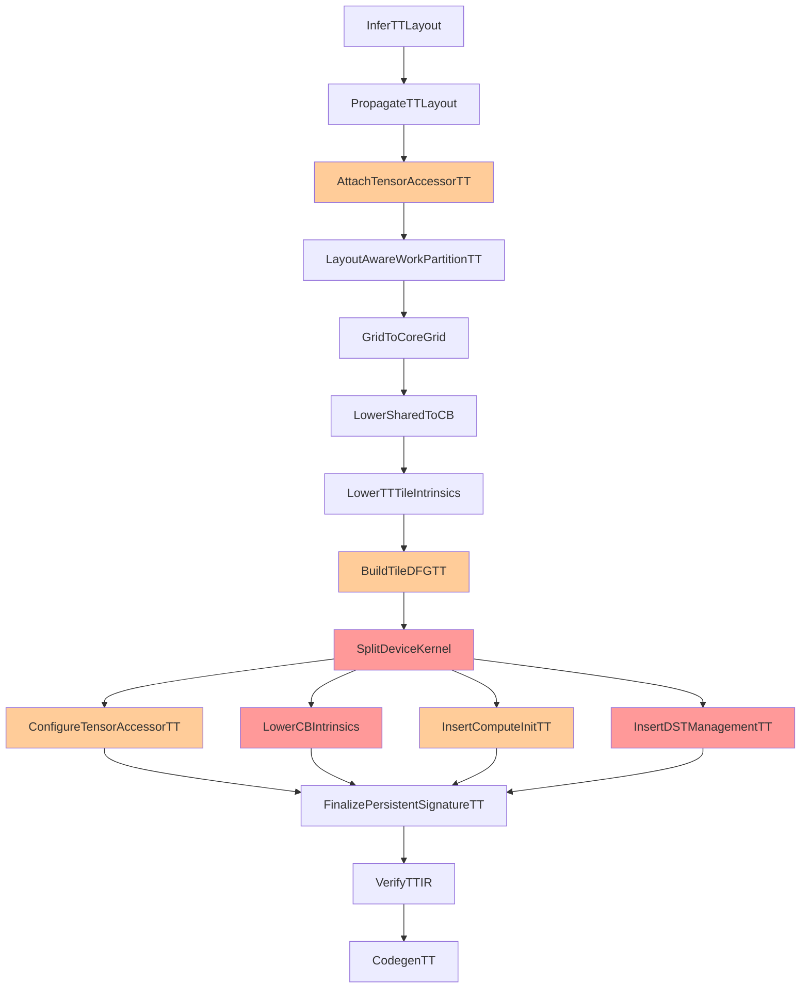

# Valuable Content Extracted from TT_Pass_Specifications.md

**Date:** 2025-10-16
**Purpose:** Preserve valuable algorithm descriptions and examples from TT_Pass_Specifications.md before archiving

---

## Overview

This document contains valuable content extracted from TT_Pass_Specifications.md that should be incorporated into v5 documentation or saved for future reference. C++ implementation templates have been intentionally excluded as the project is Python-only.

---

## Critical Pass Algorithms

### D1: SplitDeviceKernel Algorithm

**Purpose**: Split monolithic kernel into reader/compute/writer kernels

#### Algorithm (Valuable for v5_pipeline.md)
```
1. Analyze TIR to identify:
   - Data movement operations (reads/writes)
   - Compute operations (matmul, binary ops)
   - Buffer dependencies

2. Create three PrimFunc clones:
   - Reader: Contains only read_to_cb operations
   - Compute: Contains only compute operations
   - Writer: Contains only write_from_cb operations

3. Assign CB IDs based on dataflow graph:
   - Input CBs: cb_in0, cb_in1, ... (up to cb_in7)
   - Output CBs: cb_out0, cb_out1, ... (up to cb_out7)
   - Intermediate CBs: cb_intermed0, ... (if needed)

4. Update function signatures:
   - Reader: Takes input tensors
   - Compute: No tensor arguments (uses CBs)
   - Writer: Takes output tensors

5. Stamp kernel role attributes
```

#### Input/Output Example (Valuable for future pass-specific docs)

**Input (Monolithic)**:
```python
@T.prim_func
def gemm_monolithic(A: T.Buffer, B: T.Buffer, C: T.Buffer):
    A_cb = tt.alloc_cb("cb_a", (4, 1), "bf16")  # 4 tiles
    B_cb = tt.alloc_cb("cb_b", (1, 4), "bf16")
    C_cb = tt.alloc_cb("cb_c", (4, 4), "bf16")

    for kt in T.serial(8):
        T.evaluate(tt.read_to_cb(A[m, kt*32], A_cb))
        T.evaluate(tt.read_to_cb(B[kt*32, n], B_cb))
        T.evaluate(tt.mm.mma(A_cb, B_cb, dst=0, accumulate=(kt>0)))

    T.evaluate(tt.write_from_cb(C_cb, C[m, n]))
```

**Output (3 Kernels)**:
```python
@T.prim_func(attrs={"tt.kernel_role": "reader"})
def gemm_reader(A: T.Buffer, B: T.Buffer):
    # CBs get concrete IDs
    for kt in T.serial(8):
        T.evaluate(tt.read_to_cb(A[m, kt*32], "cb_in0"))
        T.evaluate(tt.read_to_cb(B[kt*32, n], "cb_in1"))

@T.prim_func(attrs={"tt.kernel_role": "compute"})
def gemm_compute():
    for kt in T.serial(8):
        T.evaluate(tt.mm.mma("cb_in0", "cb_in1", dst=0, accumulate=(kt>0)))
    # Note: packing to cb_out0 will be added by D5

@T.prim_func(attrs={"tt.kernel_role": "writer"})
def gemm_writer(C: T.Buffer):
    T.evaluate(tt.write_from_cb("cb_out0", C[m, n]))
```

---

### D3: LowerCBIntrinsics Algorithm

**Purpose**: Replace abstract CB operations with NOC/CB protocol sequences

#### Algorithm (Valuable for v5_pipeline.md)
```
1. For each tt.read_to_cb:
   a. Insert cb_reserve_back
   b. Get write pointer
   c. Insert noc_async_read_tile
   d. Insert noc_async_read_barrier
   e. Insert cb_push_back

2. For each tt.write_from_cb:
   a. Insert cb_wait_front
   b. Get read pointer
   c. Insert noc_async_write_tile
   d. Insert noc_async_write_barrier
   e. Insert cb_pop_front

3. Handle pipelining optimizations:
   - Batch barriers for multiple tiles
   - Double-buffering patterns
```

#### Input/Output Example (Valuable for future pass-specific docs)

**Input (Abstract)**:
```python
# Reader kernel
T.evaluate(tt.read_to_cb(A[tile_m, tile_k], "cb_in0"))
```

**Output (Protocolized)**:
```python
# Reader kernel with full protocol
T.evaluate(cb_reserve_back("cb_in0", 1))
write_ptr = get_write_ptr("cb_in0")
tile_id = tile_m * Kt + tile_k
T.evaluate(noc_async_read_tile(tile_id, A_accessor, write_ptr))
T.evaluate(noc_async_read_barrier())
T.evaluate(cb_push_back("cb_in0", 1))
```

---

### D5: InsertDSTManagementTT Algorithm

**Purpose**: Wrap compute operations with DST register lifecycle management

#### Algorithm (Valuable for v5_pipeline.md)
```
1. Identify compute patterns:
   - K-loop accumulation (matmul with reduction)
   - Per-tile operations (element-wise)

2. For K-loop patterns:
   - Insert acquire BEFORE loop
   - Keep compute operations
   - Insert commit/wait/pack/release AFTER loop

3. For per-tile patterns:
   - Insert acquire/commit/wait/pack/release PER tile

4. Add CB synchronization:
   - cb_wait_front before compute
   - cb_pop_front after compute
   - cb_reserve_back before pack
   - cb_push_back after pack
```

#### Input/Output Example (Valuable for future pass-specific docs)

**Input (K-loop pattern)**:
```python
for kt in T.serial(8):
    T.evaluate(tt.mm.mma("cb_in0", "cb_in1", dst=0, accumulate=(kt>0)))
```

**Output (With DST management)**:
```python
T.evaluate(tt.dst.acquire())

for kt in T.serial(8):
    T.evaluate(cb_wait_front("cb_in0", 1))
    T.evaluate(cb_wait_front("cb_in1", 1))
    T.evaluate(tt.mm.mma("cb_in0", "cb_in1", dst=0, accumulate=(kt>0)))
    T.evaluate(cb_pop_front("cb_in0", 1))
    T.evaluate(cb_pop_front("cb_in1", 1))

T.evaluate(cb_reserve_back("cb_out0", 1))
T.evaluate(tt.dst.commit())
T.evaluate(tt.dst.wait())
T.evaluate(pack_tile(dst=0, cb="cb_out0", tile_index=0))
T.evaluate(tt.dst.release())
T.evaluate(cb_push_back("cb_out0", 1))
```

---

### C3: BuildTileDFGTT Algorithm

**Purpose**: Build tile-level dataflow graph for CB assignment

#### Algorithm (Valuable for v5_pipeline.md)
```
1. Traverse TIR to find all CB allocations
2. Build producer-consumer relationships:
   - read_to_cb produces to CB
   - CB consumed by compute ops
   - compute ops produce to output CB
   - write_from_cb consumes from CB
3. Assign roles to CBs (input_a, input_b, output, intermediate)
4. Validate CB count (≤32 total)
5. Store as tt.tile_dfg attribute
```

---

### A3: AttachTensorAccessorTT Algorithm

**Purpose**: Create abstract tensor accessor metadata

#### Algorithm (Valuable for v5_pipeline.md)
```
1. For each buffer in function signature:
   - Create abstract accessor descriptor
   - Link to layout descriptor
   - Set stride mode based on layout
   - Leave runtime binding fields null
2. Store as buffer attribute
```

---

### D2: ConfigureTensorAccessorTT Algorithm

**Purpose**: Bind tensor accessors to runtime arguments

#### Algorithm (Valuable for v5_pipeline.md)
```
1. For reader/writer kernels only:
   - Get runtime arg order from tt.runtime_args
   - For each buffer:
     - Find corresponding arg index
     - Calculate tile_size_bytes
     - Update accessor with binding info
2. Store updated accessors
```

---

## Testing Templates

### Unit Test Template (Valuable for testing guide)

```python
def test_pass_name_basic():
    """Test basic functionality of PassName"""
    # Create input IR
    @T.prim_func
    def before(A: T.Buffer((256, 256), "bf16")):
        # Input IR structure
        pass

    # Apply pass
    after = tvm.tir.transform.PassName()(before)

    # Verify output
    assert "expected_attribute" in after.attrs
    assert after.attrs["expected_attribute"] == expected_value

def test_pass_name_edge_cases():
    """Test edge cases"""
    # Test with maximum CBs (32)
    # Test with minimum buffers (0)
    # Test with unusual tile sizes

def test_pass_name_errors():
    """Test error handling"""
    # Test CB overflow (>32)
    # Test missing metadata
    # Test invalid patterns
```

### Integration Test Template (Valuable for testing guide)

```python
def test_pipeline_segment():
    """Test pass pipeline segment"""
    # Input kernel
    kernel = create_test_kernel()

    # Apply pass sequence
    passes = [
        PassA(),
        PassB(),
        PassC()
    ]

    for pass_func in passes:
        kernel = pass_func(kernel)
        validate_intermediate(kernel)

    # Verify final state
    assert_valid_output(kernel)
```

---

## Pass Dependency Graph

The following dependency graph is valuable for understanding pass ordering:



Legend:
- 🔴 Red: Critical new passes (P0)
- 🟡 Orange: Important new passes (P1)
- ⬜ White: Existing passes needing updates

---

## Implementation Checklist Template

This checklist structure is valuable for tracking implementation progress:

### Phase 1: Critical Path (P0)
- [ ] D1: SplitDeviceKernel
  - [ ] Dataflow analysis
  - [ ] Statement classification
  - [ ] CB ID assignment
  - [ ] Function cloning and filtering
- [ ] D3: LowerCBIntrinsics
  - [ ] Reader protocol insertion
  - [ ] Writer protocol insertion
  - [ ] Pipelining optimizations
- [ ] D5: InsertDSTManagementTT
  - [ ] K-loop pattern detection
  - [ ] Per-tile pattern detection
  - [ ] DST lifecycle insertion
  - [ ] CB synchronization

### Phase 2: Supporting Infrastructure (P1)
- [ ] C3: BuildTileDFGTT
  - [ ] Graph construction
  - [ ] Role assignment
  - [ ] Validation
- [ ] A3: AttachTensorAccessorTT
  - [ ] Abstract descriptor creation
  - [ ] Layout linking
- [ ] D2: ConfigureTensorAccessorTT
  - [ ] Runtime arg binding
  - [ ] Tile size calculation
- [ ] D4: InsertComputeInitTT
  - [ ] Pattern detection
  - [ ] Init call insertion

---

## Recommendations for Incorporation

### Into v5_pipeline.md
1. **Algorithm descriptions** for all passes (without C++ code)
2. **Pass dependency graph** to show ordering
3. **CB assignment rules** and limits

### For Future Individual Pass Documentation
1. **Input/output examples** for each pass
2. **Edge cases** and error conditions
3. **Testing patterns** specific to each pass

### For Testing Documentation
1. **Unit test template** structure
2. **Integration test template** for pipeline segments
3. **Validation checklist** items

---

## Content Discarded

The following content from TT_Pass_Specifications.md was intentionally discarded:
1. All C++ implementation templates (lines 85-120, 167-217, 272-317, etc.)
2. C++ migration-specific content
3. Phase 3: C++ Migration section (lines 573-578)
4. All C++ class definitions and implementation details

---

**Document Created:** 2025-10-16
**Purpose:** Preserve valuable non-C++ content before archiving TT_Pass_Specifications.md